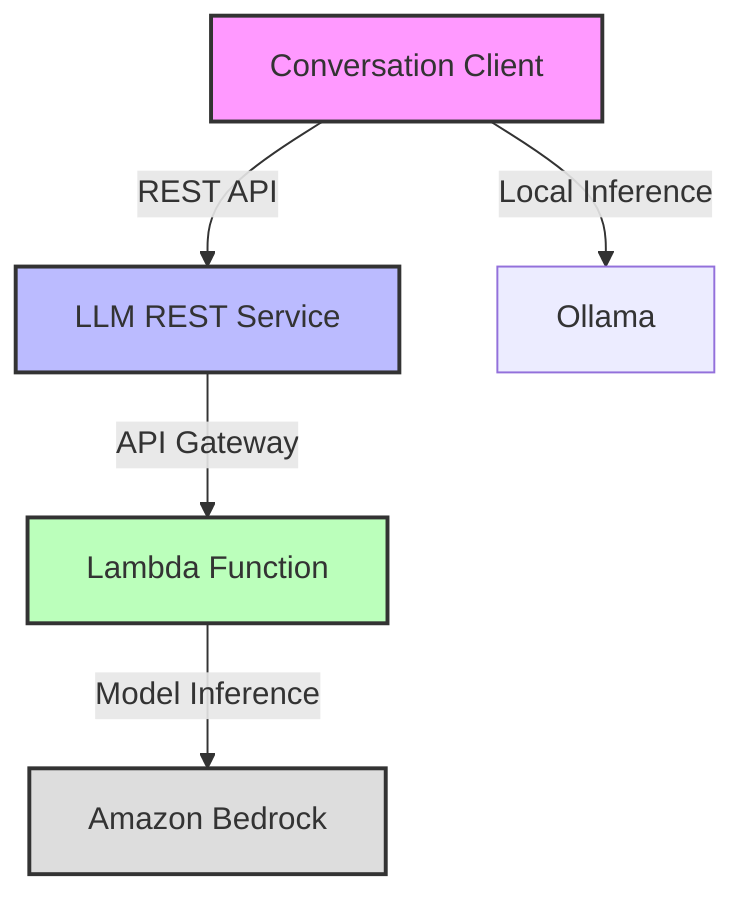
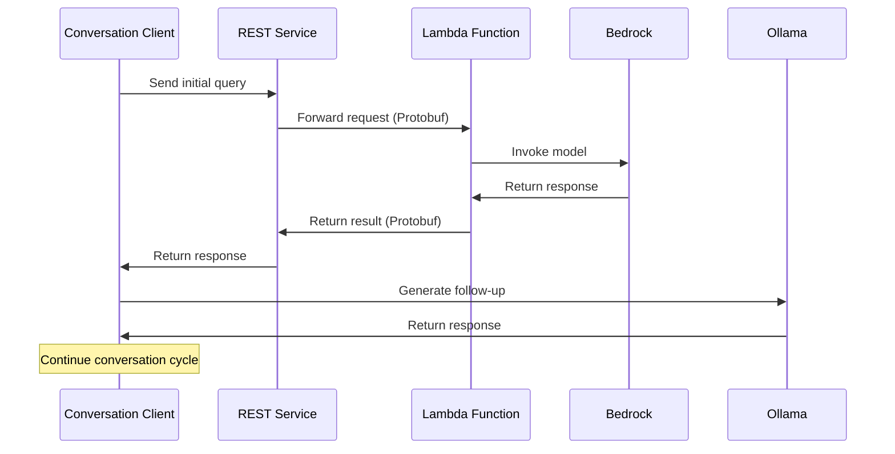

# Name - Pooja Shinde
# Email - pshin8@uic.edu

# LLM-Conversation-Service
A scalable, distributed system for LLM inference and conversation management using cloud (Bedrock) and local models(Ollama).

## System Overview
This project implements a distributed LLM processing system with three main components:
1. **LLM REST Service**: Primary interface for LLM inference (uses GRPC and Protobuf to request data from API-Gateway which then contacts Lambda function deployed on AWS Lambda)
2. **Conversation Client**: Orchestrates conversations between cloud LLM and local Ollama Model. The conversation continues till the terminating condition of max no. of turns is completed.
3. **Lambda Bedrock Integration**: Deserializes/Serializes the base 64 encoded protobuf requests/responses and acts as a Serverless interface to Amazon Bedrock.

## Youtube Videos
[LLM Conversation Part 1](https://youtu.be/s69eAqRwFCc)

[LLM COnversation Part 2](https://youtu.be/UMbMkA1vHRo)

[LLM Conversation Part 3](https://youtu.be/_2ayuQUpFZo)

[LLM Conversation Part 4](https://youtu.be/Qj_2uaaHEfw)

[LLM Conversation Part 5](https://youtu.be/WRXnmujMu3g)

## Architecture

### Component Interaction


### Data Flow


## Components

### 1. LLM REST Service
The entry point for LLM inference requests.

Key Features:
- RESTful API interface
- Protocol Buffer serialization
- Request/response validation
- Comprehensive logging
- Health monitoring

Configuration (`application.conf`):
```hocon
http {
  host = "0.0.0.0"
  port = 8080
}

service {
  api-gateway-url = "https://your-api-gateway-url"
}
```

### 2. Conversation Client
Orchestrates conversations between cloud and local LLM services.

Key Features:
- Asynchronous processing
- CSV export
- Conversation management
- Performance monitoring
- Local model integration

Configuration (`application.conf`):
```hocon
ollama {
  host = "http://localhost:11434"
  model = "llama2:latest"
}

conversation {
  max-turns = 5
  timeout-minutes = 30
}
```

### 3. Lambda Bedrock Integration
Serverless interface to Amazon Bedrock.

Key Features:
- AWS Lambda integration
- Bedrock model invocation
- Protocol Buffer handling
- Error recovery
- CloudWatch monitoring

Configuration (Environment Variables):
```bash
AWS_REGION=us-east-1
BEDROCK_MODEL_ID=anthropic.claude-v2
```

## Setup

### Prerequisites
- Java 11
- Scala 2.13.10
- SBT 1.x
- AWS Account
- Ollama installed
- Protocol Buffer compiler

### Installation

1. Clone repositories:
```bash
git clone [main-repo-url]
cd llm-server
```

2. Install dependencies:
```bash
# For MacOS
brew install protobuf
brew install scala
brew install sbt
brew install ollama

# For Ubuntu
sudo apt-get update
sudo apt-get install protobuf-compiler scala sbt
# Install Ollama for Linux
```

3. Build all components:
```bash
# Build REST Service
cd llm-server
sbt clean compile assembly

# Build Conversation Client
cd ../conversation-client
sbt clean compile assembly

# Build Lambda Function
cd ../lambda-function
sbt clean compile assembly
```
# Deployment Guide

## Prerequisites
- Lambda Function configured and deployed as shown in video.
- AWS Account
- SBT installed locally
- Basic understanding of AWS EC2

## Server Service Deployment

1. Launch EC2 Instance:
   - Amazon Linux 2023
   - t2.micro (Free tier)
   - Security Group: Allow ports 22(SSH) and 8080

2. Deploy Server:
```bash
# Install Java
sudo yum update -y
sudo yum install -y java-11-amazon-corretto-devel

# Setup Application
sudo mkdir -p /opt/llm-service
cd /opt/llm-service

# Create Service
sudo tee /etc/systemd/system/llm-service.service << 'EOL'
[Unit]
Description=LLM REST Service
After=network.target

[Service]
Type=simple
User=ec2-user
WorkingDirectory=/opt/llm-service
ExecStart=/usr/bin/java -jar llm-rest-service.jar
Restart=always

[Install]
WantedBy=multi-user.target
EOL

# Copy Jar from s3 to ec2 instance
aws s3 cp s3://llm-rest-service-assembly-0.1.0-SNAPSHOT.jar llm-service.jar

# Deploy JAR and Start Service
sudo systemctl enable llm-service
sudo systemctl start llm-service

# Check logs
tail -f /opt/llm-service/logs/llm-service.log
```

## Client Service Deployment

1. Launch EC2 Instance:
   - Amazon Linux 2023
   - t2.large (8GB RAM required for Ollama)
   - Security Group: Allow ports 22(SSH), 8081, and 11434(Ollama)

2. Install Ollama:
```bash
curl -fsSL https://ollama.com/install.sh | sh
ollama pull llama2
```

3. Deploy Client:
```bash
# Install Java
sudo yum update -y
sudo yum install -y java-11-amazon-corretto-devel

# Setup Application
sudo mkdir -p /opt/conversation-client
cd /opt/conversation-client

# Create Service
sudo tee /etc/systemd/system/conversation-client.service << 'EOL'
[Unit]
Description=Conversation Client Service
After=network.target

[Service]
Type=simple
User=ec2-user
WorkingDirectory=/opt/conversation-client
ExecStart=/usr/bin/java -Xmx512m -jar conversation-client.jar
Restart=always

Environment="OLLAMA_HOST=http://localhost:11434"
Environment="OLLAMA_MODEL=llama2:latest"
Environment="SERVICE_HOST=<SERVER-EC2-IP>"
Environment="SERVICE_PORT=8080"
Environment="SERVER_HOST=0.0.0.0"
Environment="SERVER_PORT=8081"

[Install]
WantedBy=multi-user.target
EOL

# Copy Jar from s3 to ec2 instance
aws s3 cp s3://conversation-client-deployment/conversation-client-assembly-1.0.jar conversation-client.jar

# Deploy JAR and Start Services
sudo systemctl enable ollama conversation-client
sudo systemctl start ollama conversation-client

# Check logs
tail -f /opt/conversation-client/logs/conversation-server.log
```

## Testing

1. Test Server Service:
```bash
curl -X POST http://<SERVER-EC2-IP>:8080/api/v1/generate \
-H "Content-Type: application/json" \
-d '{
  "inputText": "Hello",
  "temperature": 0.7,
  "maxTokens": 100
}'
```

2. Test Client Service:
```bash
curl -X POST http://<CLIENT-EC2-IP>:8081/conversation \
-H "Content-Type: application/json" \
-d '{
  "initialQuery": "What is the meaning of life?",
  "outputFile": "/opt/conversation-client/conversation.csv"
}'
```

## Monitoring

```bash
# View service logs
sudo journalctl -u llm-service -f        # Server logs
sudo journalctl -u conversation-client -f # Client logs
sudo journalctl -u ollama -f             # Ollama logs
```

Note: Replace `<SERVER-EC2-IP>` and `<CLIENT-EC2-IP>` with your actual EC2 instance public IPs.

## Usage

### Start a Conversation
```bash
curl -X POST http://localhost:8081/conversation \
  -H "Content-Type: application/json" \
  -d '{
    "initialQuery": "Tell me about machine learning",
    "outputFile": "conversation.csv"
  }'
```

### Monitor the Process
1. Check REST Service logs: `logs/application.log`
2. Check Conversation Client logs: `logs/conversation-server.log`
3. Monitor Lambda through CloudWatch

## Error Handling
The system implements comprehensive error handling:

1. **Network Failures**
   - Automatic retries
   - Circuit breaking
   - Timeout handling

2. **Service Errors**
   - Invalid requests
   - Model failures
   - Resource constraints

3. **Integration Issues**
   - Serialization errors
   - Protocol mismatches
   - Configuration problems

## Monitoring

### Metrics
- Request latency
- Processing time per turn
- Memory usage
- Error rates
- Model performance

### Logging
- Structured logging across components
- CloudWatch integration
- Performance tracking
- Error tracing

## Development

### Project Structure
```
llm-conversation-service/
├── llm-server/
│   └── src/
│       └── main/
│           ├── scala/
│           └── resources/
├── conversation-client/
│   └── src/
│       └── main/
│           ├── scala/
│           └── resources/
└── lambda-function/
    └── src/
        └── main/
            ├── scala/
            └── resources/
```

## Troubleshooting

Common issues and solutions:

1. **Connection Errors**
   - Verify service URLs
   - Check AWS credentials
   - Confirm network access

2. **Performance Issues**
   - Monitor memory usage
   - Check log files
   - Verify configuration

3. **Integration Problems**
   - Validate Protocol Buffer versions
   - Check service compatibility
   - Verify AWS permissions
